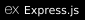
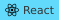
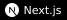
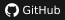

<!-- https://github.com/dev-ratul-anjum/ -->
<!-- MERN Stack Developer -->
<!-- LEAVE A STAR, IF YOU LIKE IT ! -->

<!-- Profile Views Counter -->

<!-- Typing Animation -->

  

<!-- Title -->
<h3 align="center">
        <samp>&gt; Hey There!, I am
                <b><a target="_blank" href="https://ratulanjum.onrender.com/">Ratul Anjum</a></b>
        </samp>
</h3>
 

        <!-- Intro -->
        <samp>
                「 I'm a full stack MERN developer specializing in building modern web applications 」
                 
                「 Focused on creating scalable and elegant digital solutions that elevate user experiences 」
                 
                 
        </samp>
        <!-- Technologies -->
        <!-- MongoDB -->
        
        <!-- Express.js -->
        
        <!-- React -->
        
        <!-- Node.js -->
        
        <!-- JavaScript -->
        
        <!-- TypeScript -->
        
         
        <!-- NextJS -->
        
        <!-- Redux -->
        
        <!-- TailwindCSS -->
        
        <!-- Git -->
        
        <!-- Docker -->
        
        <!-- AWS -->
        

<!-- Details Section -->

    
 <samp>&#9776; More</samp>

    

         
        <!-- Activity Widget -->
        
         
        <!-- Most Used Languages -->
        
         
        <!-- Social Links -->
        
Find me on

        <!-- Mail -->
        
        <!-- LinkedIn -->
        
        <!-- GitHub -->
        
        <!-- Portfolio -->
        
    

 

<!-- Footer -->
<samp>
    

        ════ ⋆★⋆ ════
         
        "Building digital excellence 💻"
    

</samp>

<!-- Featured Repositories -->
#### Featured Projects

&nbsp;

&nbsp;

